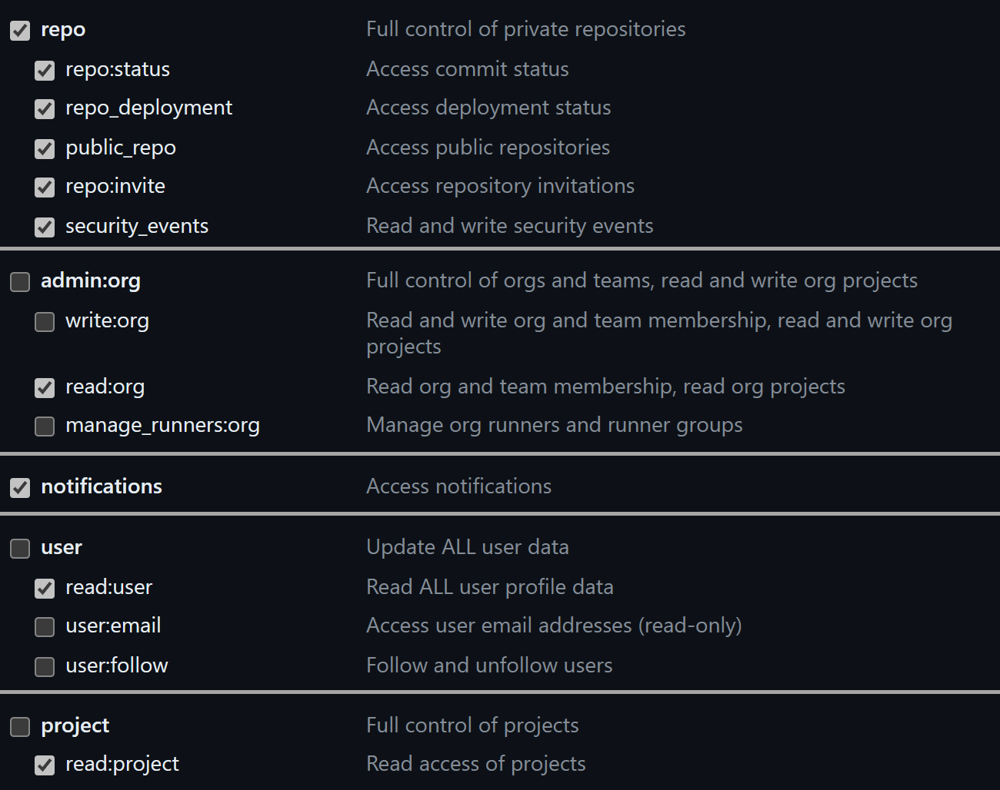

# 初期設定

Amethystを使用するためには、以下2つの設定が必要です。

- URL
- Token

## URL

URLには以下を設定してください。

```
https://api.github.com/
```

GitHub EnterpriseでURLが変わる場合は以下のように設定してください。

```
https://(Domain)/api/v3/
```

## Token

使用するには、GitHub Tokenが必要になります。

こちら https://github.com/settings/tokens からTokenを取得してください。

最低限必要な権限は以下になります。



<div class="nav">
  <a href="install.html" class="btn">Back: インストール方法</a>
</div>
