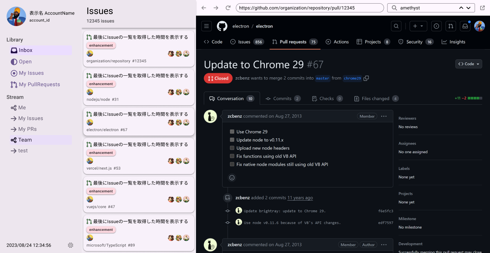

  

    
  

  

    
  

  <ul class="page-list">
    <li>使い方
      <ul>
        <li><a href="{{ '/detail/install.html' | relative_url }}">インストール方法</a></li>
        <li><a href="{{ '/detail/setup.html' | relative_url }}">初期設定</a></li>
      </ul>
    </li>
    <li><a href="{{ '/detail/developer.html' | relative_url }}">開発者向け</a></li>
  </ul>

  

  <a href="{{ '/detail/install.html' | relative_url }}" class="nav__btn nav__btn--next">インストール方法</a>

